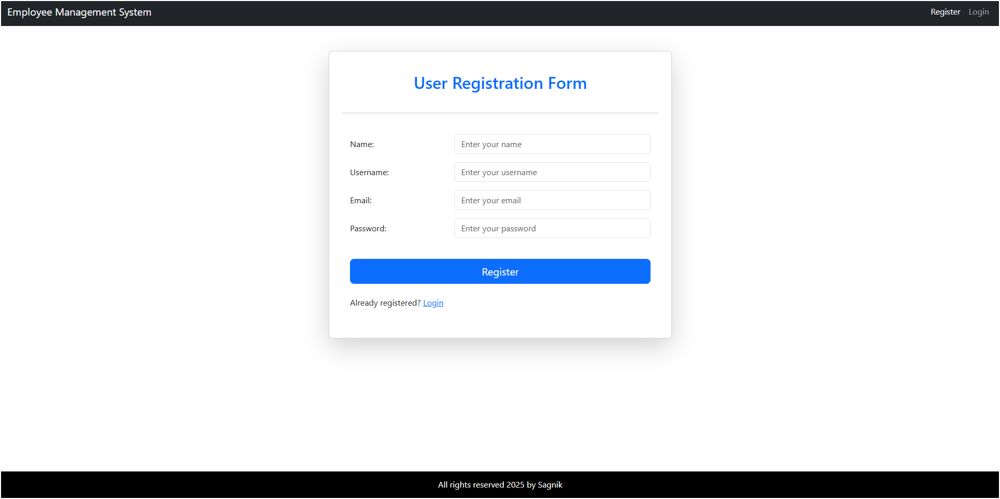

# Employee Management System

## Overview

The **Employee Management System** is a full-stack application built as a practice project. It helps manage employees, departments, and tasks (todos). The application covers basic CRUD operations for employees, departments, and todos, and is built using **Spring Boot** for the backend and **React** for the frontend. **Spring Security** and **JWT** (JSON Web Tokens) are used for authentication and authorization.

## Features

- **Employee Management**: Create, read, update, and delete employee records.
- **Department Management**: Manage departments and assign employees to them.
- **Todo Management**: Create, update, and track todos for employees.
- **Authentication & Authorization**: Secure the application with login functionality using **Spring Security** and **JWT**.
- **JWT Authentication**: Use JWT tokens to authenticate and authorize API requests.

## Technologies Used

- **Backend**: Spring Boot, Spring Security, JWT
- **Frontend**: React
- **Database**: PostgreSQL
- **Security**: Spring Security with JWT for user authentication and authorization

## Setup & Installation

1. Clone the repository.
2. Set up the backend with PostgreSQL and JWT authentication.
3. Run the Spring Boot application.
4. Set up the frontend by installing dependencies and running the React app.
5. Access the application in the browser.

## Contributing

Feel free to fork the repository and submit pull requests for any improvements or new features.
